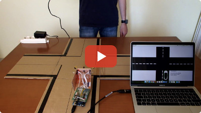

# DRIPS
### Decentralized Relative Inertial Positioning System
_Daniele Di Sarli, Diego Giorgini_

This proof of concept implements a detection, communication and coordination system between small-scaled cars in a crossroad without any centralized infrastructure.

Each car is able to:

 * detect other vehicles around it
 * communicate with them in order to compute the precedence according to road rules, or to signal an emergency situation

The system has been realized by relying only on these three basic components:

 * IR emitters
 * IR receivers
 * Radio card

The following is a video showing the results of the project:

